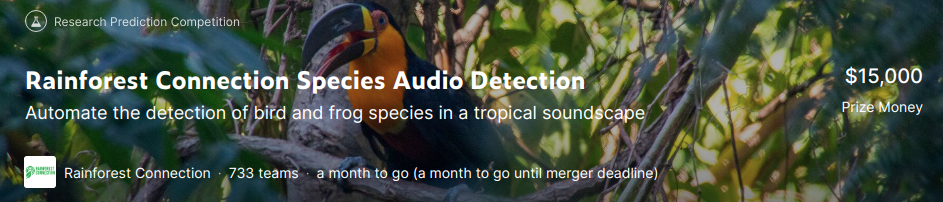

  
# Rainforest-Connection-Species-Audio-Detection

[Rainforest-Connection-Species-Audio-Detection](https://www.kaggle.com/c/rfcx-species-audio-detection/overview) コンペのリポジトリ

## Links

- [googledrive](https://drive.google.com/drive/u/1/folders/1oTq6R1t5OZCwaVR9u9ChoA_SRZi6r7Ol)
- [issue board](https://github.com/fkubota/kaggle-Rainforest-Connection-Species-Audio-Detection/projects/1)

## Paper
hoge

## Task
**Overview(DeepL)**

## Log
### 20201006
